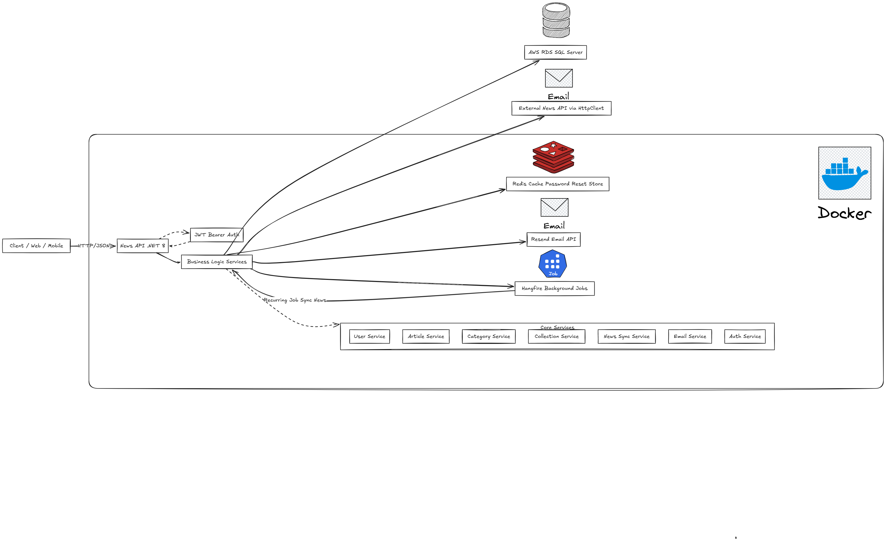

## News API (SynergieGlobal – Junior Software Engineer Application)

A concise .NET 8 Web API for news aggregation with a clean layered architecture (Controllers → Services → Repositories → EF Core). This repository is part of a job application for the Junior Software Engineer position at SynergieGlobal.

### Architecture (High-level)


- **API**: ASP.NET Core (.NET 8), Swagger/OpenAPI
- **Auth**: JWT Bearer Authentication
- **Background jobs**: Hangfire (recurring sync tasks)
- **Data**: EF Core → SQL Server (ready for **AWS RDS**)
- **Cache/Store**: Redis (Password Reset Store)
- **Email**: Resend API
- **External**: News API (via HttpClient)

### Main Features
- **Authentication & Authorization** (JWT)
- **Articles, Categories, Collections** CRUD
- **User Subscriptions**
- **Password Reset** via Redis-backed store
- **Hourly News Sync** via Hangfire

### Quick Start
1. Prerequisites: .NET 8 SDK, Docker & Docker Compose
2. Copy environment file: `cp env.example .env` (set `RESEND_APITOKEN`, `REDIS_CONNECTION`, connection strings, etc.)
3. Start infrastructure (optional if you use AWS services directly):
   ```bash
   docker compose up -d
   ```
4. Configure database:
   - Local SQL Server: use the `DefaultConnection` in `appsettings.json`
   - **AWS RDS**: set the connection string to your RDS SQL Server in `appsettings.json` or environment variables
5. Run the API:
   ```bash
   dotnet restore
   dotnet run --project News.Api
   ```

### Useful URLs
- Swagger UI: `/swagger`
- Hangfire Dashboard: `/hangfire`
- Health Check: `/health`

### Notes
- This project is for the Junior Software Engineer application at SynergieGlobal.
- Keep configuration secure in production (keys, tokens, connection strings via environment variables or a secret manager).
